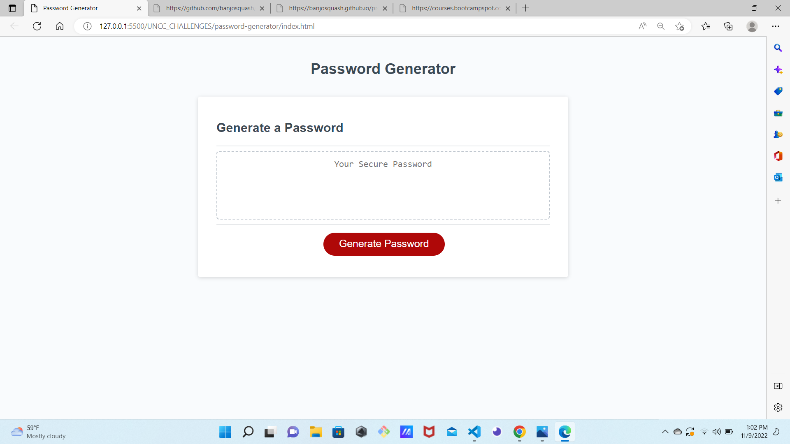

### License: , (https://opensource.org/licenses/MIT)

# Title: Password Generator
## Screenshot

## Deployed link
https://banjosquash.github.io/password-generator/

## Description:
This app will generate a random password.It gives the users choices along the way about certain password qualities, and generates a password based on user selections. No two passwords are the same!
## Table of Contents:
* [title](#title)
* [Description](#description)
* [Table of Contents](#table-of-contents)
* [Installation](#installation)
* [Usage](#usage)
* [License](#license)
* [Contributing](#contributing)
* [Testing](#testing)
* [Questions](#questions)
      
## Installation: All you have to do click the link to the app, click "generate password" then follow the prompts.

## Usage: 
see installation^
## Licensing: This application is covered under MIT License.

## Contributing: 
feel free to contribute to this project!
## Testing Instructions: 
testing was done in the code editor.
## Questions: 
Feel free to ask any questions.
Contact Me:

Github: https://github.com/banjosquash

Email: braymcmahan@yahoo.com
